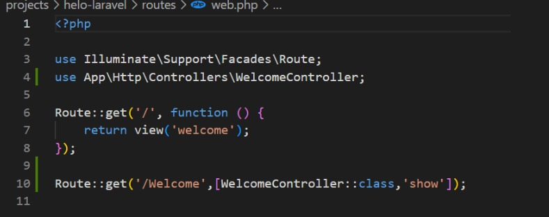
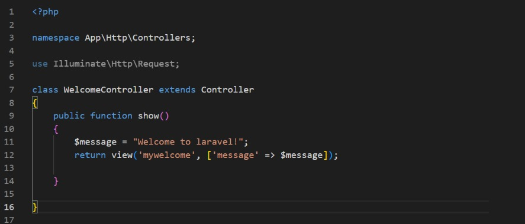
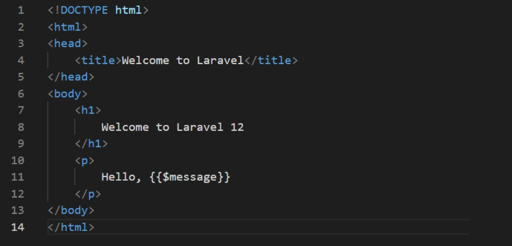
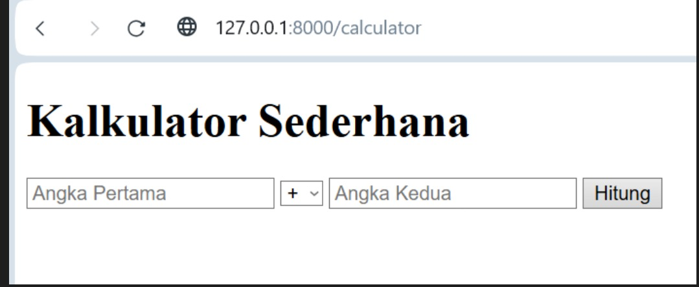

# Laporan Modul 2: Laravel Fundamentasl
**Mata Kuliah:** Workshop Web Lanjut   
**Nama:** Muhammad Dhiyaul Atha 
**NIM:** 2024573010075
**Kelas:** TI 2B

---

## Abstrak 

Laporan ini membahas hasil praktikum yang dilakukan sebagai bagian dari mata kuliah terkait. Praktikum bertujuan untuk memberikan pemahaman konseptual sekaligus keterampilan praktis mengenai [isi/modul praktikum, misalnya: pengenalan framework Laravel, dasar jaringan komputer, atau topik sesuai laporan]. Melalui kegiatan ini, mahasiswa diharapkan mampu memahami teori yang telah dipelajari di kelas dan menerapkannya dalam bentuk praktik langsung.

Tujuan dari penyusunan laporan ini adalah untuk mendokumentasikan langkah-langkah, hasil pengamatan, serta analisis yang diperoleh selama praktikum. Selain itu, laporan ini juga menjadi sarana evaluasi terhadap tingkat pemahaman mahasiswa, serta memberikan gambaran menyeluruh tentang manfaat praktikum dalam mendukung proses pembelajaran.

---

## 1. Dasar Teori
- Apa itu MVC (Model, View, Controller).
MVC adalah pola arsitektur yang digunakan dalam pengembangan aplikasi berbasis web.

Model berfungsi sebagai penghubung ke database atau sumber data, mengatur logika bisnis dan manipulasi data.

View berfungsi untuk menampilkan data dalam bentuk antarmuka pengguna (UI).

Controller bertugas menerima request dari pengguna, memprosesnya dengan bantuan Model, lalu mengirimkan hasilnya ke View.
- Konsep Routing di Laravel.
Routing adalah mekanisme yang digunakan Laravel untuk menentukan bagaimana aplikasi merespons permintaan (request) dari pengguna berdasarkan URL.

Di Laravel, routing didefinisikan dalam file routes/web.php untuk request berbasis web dan routes/api.php untuk API.

Routing bisa mengarahkan request ke sebuah Closure (fungsi anonim), ke sebuah Controller, atau menampilkan View langsung.
- Fungsi Middleware.
Middleware adalah lapisan perantara (filter) yang memproses request sebelum mencapai Controller atau response sebelum dikirim ke pengguna.
Fungsinya antara lain:

Autentikasi (memastikan user sudah login).

Proteksi CSRF (Cross-Site Request Forgery).

Logging atau pencatatan aktivitas.

Pembatasan akses berdasarkan role pengguna.
- Bagaimana cara Laravel menangani Request dan Response.
User mengirim request melalui browser.

Request diterima oleh public/index.php, yang menjadi entry point aplikasi Laravel.

Laravel memproses request melalui HTTP Kernel, kemudian melewati middleware.

Router menentukan ke mana request tersebut diarahkan (controller, closure, atau view).

Controller menjalankan logika dan berinteraksi dengan Model jika diperlukan.

Data diproses dan dikirim ke View untuk ditampilkan.

Laravel mengirimkan response kembali ke browser.
- Peran Controller dan View.
Controller: mengatur logika aplikasi, menerima input dari request, mengelola data dengan bantuan Model, lalu mengembalikan data ke View.

View: berfokus pada presentasi data kepada pengguna. Biasanya menggunakan template Blade untuk membuat tampilan dinamis.
- Fungsi Blade Templating Engine.
Blade adalah template engine bawaan Laravel yang digunakan untuk membuat tampilan dinamis dengan sintaks sederhana.
Keunggulannya:

Mendukung pewarisan template dengan @extends, @section, dan @yield.

Mendukung kontrol alur dengan @if, @foreach, @for, dll.

Mudah menggabungkan data dari controller ke view dengan sintaks {{ $variable }}.

Mendukung komponen dan include agar kode tampilan lebih modular.
---

## 2. Langkah-Langkah Praktikum
Tuliskan langkah-langkah yang sudah dilakukan, sertakan potongan kode dan screenshot hasil.

2.1 Praktikum 1 – Route, Controller, dan Blade View

- Tambahkan route pada routes/web.php.
        <?php

        use Illuminate\Support\Facades\Route;
        use App\Http\Controllers\WelcomeController;

        Route::get('/', function () {
            return view('welcome');
        });

        Route::get('/welcome', [WelcomeController::class, 'show']);

---

- 
Screenshot Hasil:
- Buat controller WelcomeController.
        <?php

        namespace App\Http\Controllers;

        use Illuminate\Http\Request;

        class WelcomeController extends Controller
        {
            public function show()
            {
                $message = "Welcome to laravel!";
                return view('mywelcome', ['message' => $message]);

            }
            
        }

- Buat view mywelcome.blade.php.
        <!DOCTYPE html>
        <html>
        <head>
            <title>Welcome to Laravel</title>
        </head>
        <body>
            <h1>
                Welcome to Laravel 12
            </h1>
            

                Hello, {{$message}}
            

        </body>
        </html>

- Jalankan aplikasi dan tunjukkan hasil di browser.

2.2 Praktikum 2 – Membuat Aplikasi Sederhana "Calculator"

- Tambahkan route untuk kalkulator.
        <?php

        use Illuminate\Support\Facades\Route;

        Route::get('/', function () {
            return view('welcome');
        });
        use App\Http\Controllers\CalculatorController;

        Route::get('/calculator', [CalculatorController::class, 'index']);
        Route::post('/calculator', [CalculatorController::class, 'calculate'])->name('calculator.calculate');

- Buat controller CalculatorController.
        <?php

        namespace App\Http\Controllers;

        use Illuminate\Http\Request;

        class CalculatorController extends Controller
        {
            public function index()
            {
                return view('calculator');
            }

            public function calculate(Request $request)
            {
                $validated = $request->validate([
                    'number1' => 'required|numeric',
                    'number2' => 'required|numeric',
                    'operator' => 'required|in:add,sub,mul,div'
                ]);

                $result = match ($validated['operator']) {
                    'add' => $validated['number1'] + $validated['number2'],
                    'sub' => $validated['number1'] - $validated['number2'],
                    'mul' => $validated['number1'] * $validated['number2'],
                    'div' => $validated['number2'] != 0 
                                ? ($validated['number1'] / $validated['number2']) 
                                : 'Error: Division by 0',
                };

                return view('calculator', [
                    'result' => $result,
                    'number1' => $validated['number1'],
                    'number2' => $validated['number2'],
                    'operator' => $validated['operator']
                ]);
            }
        }
        
- Tambahkan view calculator.blade.php
        <!DOCTYPE html>
        <html>
        <head>
            <title>Laravel Calculator</title>
        </head>
        <body>
            <h1>Kalkulator Sederhana</h1>

            @if ($errors->any())
                

                    <ul>
                        @foreach ($errors->all() as $error)
                            <li>{{ $error }}</li>
                        @endforeach
                    </ul>
                

            @endif

            <form method="POST" action="{{ route('calculator.calculate') }}">
                @csrf
                <input type="number" name="number1" value="{{ old('number1', $number1 ?? '') }}" placeholder="Angka Pertama" required>

                <select name="operator" required>
                    <option value="add" {{ ($operator ?? '') == 'add' ? 'selected' : '' }}>+</option>
                    <option value="sub" {{ ($operator ?? '') == 'sub' ? 'selected' : '' }}>-</option>
                    <option value="mul" {{ ($operator ?? '') == 'mul' ? 'selected' : '' }}>×</option>
                    <option value="div" {{ ($operator ?? '') == 'div' ? 'selected' : '' }}>÷</option>
                </select>

                <input type="number" name="number2" value="{{ old('number2', $number2 ?? '') }}" placeholder="Angka Kedua" required>
                <button type="submit">Hitung</button>
            </form>

            @isset($result)
                <h3>Hasil: {{ $result }}</h3>
            @endisset
        </body>
        </html>

- Jalankan aplikasi dan coba dengan beberapa input berbeda.

## 3. Hasil dan Pembahasan
Jelaskan apa hasil dari praktikum yang dilakukan.
- Apakah aplikasi berjalan sesuai harapan?
ecara umum, aplikasi berjalan sesuai harapan. Permintaan dari pengguna yang dikirim melalui browser diterima oleh Route, diproses oleh Controller, kemudian hasilnya ditampilkan ke pengguna melalui View. Proses ini menunjukkan bahwa alur kerja MVC (Model-View-Controller) di Laravel dapat berfungsi dengan baik.
- Apa yang terjadi jika ada input yang salah (misalnya pembagian dengan 0)?
Apabila terjadi kesalahan input, misalnya pengguna mencoba melakukan pembagian dengan angka nol, maka aplikasi akan menghasilkan error atau output yang tidak sesuai. Hal ini terjadi karena secara matematis pembagian dengan nol tidak terdefinisi. Untuk mencegah hal tersebut, biasanya digunakan mekanisme validasi input sehingga aplikasi tidak langsung mengeksekusi operasi yang salah.
- Bagaimana validasi input bekerja di Laravel?
Laravel menyediakan fitur Request Validation yang memungkinkan pengembang menetapkan aturan validasi sebelum data diproses lebih lanjut. Jika input tidak sesuai aturan (misalnya kosong, bukan angka, atau pembagian dengan nol), maka Laravel akan:

Mengembalikan pesan error ke pengguna.

Mengarahkan kembali ke halaman input sebelumnya.

Menampilkan pesan validasi agar pengguna dapat memperbaiki kesalahan input.
- Apa peran masing-masing komponen (Route, Controller, View) dalam program yang dibuat?
Route: berfungsi menentukan jalur akses dan menghubungkan request pengguna dengan Controller yang sesuai.

Controller: berperan sebagai pengatur logika aplikasi. Controller menerima input dari Route, melakukan perhitungan atau pemrosesan data, lalu mengirimkan hasil ke View.

View: bertanggung jawab menampilkan hasil pemrosesan data kepada pengguna dengan tampilan yang rapi dan mudah dipahami, biasanya menggunakan Blade Template.

---

## 4. Kesimpulan

Berdasarkan praktikum yang telah dilakukan, dapat disimpulkan bahwa penggunaan framework Laravel dengan pola arsitektur MVC (Model-View-Controller) memudahkan dalam pengembangan aplikasi web yang terstruktur dan terorganisir. Melalui praktikum ini, mahasiswa dapat memahami bagaimana Route, Controller, dan View saling berhubungan untuk memproses request dan menghasilkan response yang sesuai.

---

## 5. Referensi
Cantumkan sumber yang Anda baca (buku, artikel, dokumentasi) — minimal 2 sumber. Gunakan format sederhana (judul — URL).
Laravel — Dokumentasi Resmi. https://laravel.com/docs

W. J. Gilmore. Easy Laravel 5. Leanpub. https://leanpub.com/easylaravel

Tutorialspoint — Laravel Framework. https://www.tutorialspoint.com/laravel

---